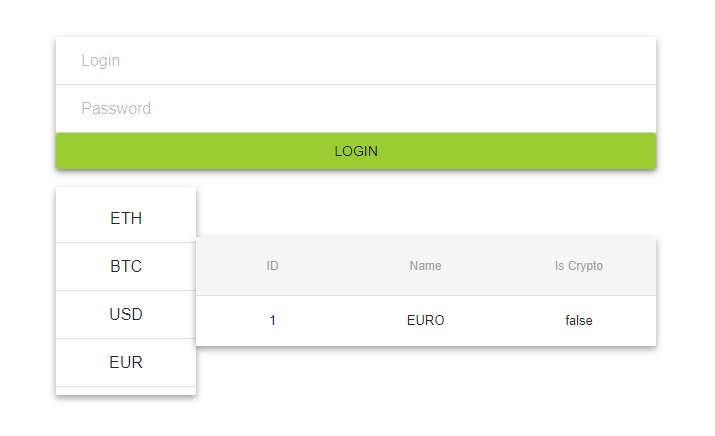

# react-amazon-login-list

Проект написан на ReactJS с использованием библиотеки [material-ui](http://www.material-ui.com).

Задача была написать на ReactJS приложение, которое авторизуется на Amazon Web Services и получает из службы JSON, который нужно представить на странице в в виде связанного списка.

Вся логика подключения сейчас закомментирована и можно вводить ЛЮБОЙ ЛОГИН и ЛЮБОЙ ПАРОЛЬ. JSON с данными вшит в программу (раньше брался со службы).

Приложение находится здесь в демонстрационных целях, как первый опыт на ReactJS.

Скомпилированная версия на Github Pages [тут](https://osmakroman.github.io/react-amazon-login-list/).

#

Установка пакетов
```bash
npm install
```
и затем компиляция
```bash
npm run build
```

#



#
